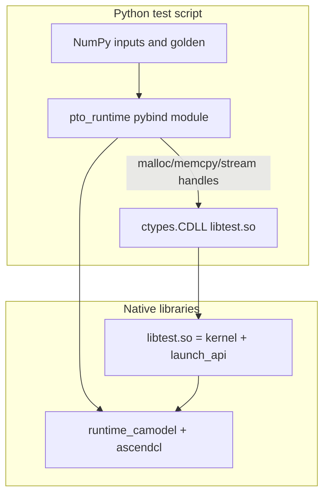

# Python Wrapper Design: Simulator-Only Execution Without Real NPU

## Problem

The C++ tests under `tests/cpp/` run PTO A5 kernels on a **CPU simulator** by linking against `runtime_camodel`. All device APIs (`aclInit`, `aclrtMalloc`, `aclrtMemcpy`, kernel launch `<<<1, nullptr, stream>>>`) are handled by the camodel stub libraries when `LD_LIBRARY_PATH` includes the simulator path.

The reference example `pto-kernels/examples/jit_cpp` uses a different stack:

- `torch.zeros(device="npu")` for device memory
- `torch_npu` for streams and pointers
- `ctypes.CDLL` to call `extern "C" call_kernel(...)` in a bisheng-built `.so`

That pattern targets **real Ascend 910 (dav-c220)** hardware. In our environment there is **no real Ascend950 NPU**. Prebuilt `torch_npu` always probes for physical devices and cannot fall back to camodel.

## Rejected alternatives

### 1. torch_npu directly

**Why it fails:** Importing `torch_npu` registers the NPU backend. `tensor.to("npu")` or `torch.zeros(..., device="npu")` invokes the real runtime, not the camodel linked at compile time of a separate module. There is no documented CPU-only emulation path in torch_npu.

### 2. LD_PRELOAD only

**Why it is insufficient:**

- Still requires loading `torch` and `torch_npu`, adding heavy dependencies and import-time device probing.
- Symbol interposition on `libascendcl.so` is fragile (version skew, loader order, which library actually gets preloaded).
- Camodel behavior in the cpp tests comes from **linking** `-lruntime_camodel` into the test binary, not from intercepting libc or ascendcl at runtime.
- Does not provide a clean NumPy-first API for public test code.

### 3. ctypes-only to libascendcl.so

**Partially viable:** `aclrtMalloc` is exported from `libascendcl.so`. However, without linking `runtime_camodel` into the Python process's extension module, calls may hit the real stub path. A small host `.so` must still be compiled with bisheng and `-lruntime_camodel`—equivalent to pybind but with more manual binding.

## Chosen approach

### 1. `pto_runtime` pybind11 module

A thin C++ extension wrapping:

- `aclInit` / `aclFinalize`
- `aclrtSetDevice`, `aclrtCreateStream`, `aclrtSynchronizeStream`
- `aclrtMallocHost`, `aclrtMalloc`, `aclrtFree`, `aclrtFreeHost`
- `aclrtMemcpy` (H2D / D2H)

Built with **bisheng `-xc++`** and linked with **`-lruntime_camodel`** using the same flags and rpath as `tests/cpp/common/bisheng_build.sh`. This mirrors the cpp host executable link line exactly.

### 2. Per-test `launch_api.cpp`

Kernels expose C++ template functions (`LaunchTAdd<float,...>`) with mangled names. Python `ctypes` cannot call them directly. Each test adds smoke-only `extern "C"` wrappers compiled into the same `lib<test>.so` as the kernel.

### 3. ctypes for kernel launch only

Following jit_cpp's **interfacing** pattern (load `.so`, set `argtypes`, call function)—but **not** its bisheng flags, arch, or torch_npu memory model.

### 4. Single `test_<op>.py` per operator

Each script prepares data (NumPy), launches via `pto_runtime` + ctypes, and verifies numerically inline. No separate `gen_data.py` or `compare.py` scripts.

### 5. Environment setup

`common/sim_env.py` sets `LD_LIBRARY_PATH` (stub + simulator lib) before importing `pto_runtime`, matching `tests/cpp/common/sim_env.sh`.

## Bisheng flags (must match cpp)

| Component | Arch flag | Notes |
|-----------|-----------|-------|
| vec tests | `--cce-aicore-arch=dav-c310-vec` | tadd, tmax, tmul, tload, syncall |
| mix tests | `--cce-aicore-arch=dav-c310` | acc2vec/mat, extract, insert |
| All kernels | `-DREGISTER_BASE`, llvm stack flags | Same as cpp `KERNEL_FLAGS` |
| Host / pybind | `-xc++`, `-lruntime_camodel` | Not jit_cpp `-DMEMORY_BASE` / `dav-c220` |

## Summary

We use **pybind + camodel-linked runtime** for ACL device semantics, and **ctypes + extern-C launch wrappers** for kernels—achieving the same execution model as the cpp smoke tests without torch_npu or a C++ `main()` entry point.

## Complementary path: tests/torch_sim

For teams on the PyTorch Ascend stack, [`tests/torch_sim`](../torch_sim/) provides the same 12 smoke cases using **torch_npu + ctypes** without linking `-lruntime_camodel`. Execution runs under **`msprof op simulator`** (Ascend950PR_9599), which satisfies torch_npu device calls without physical hardware. See [torch_sim_design_doc.md](../torch_sim/torch_sim_design_doc.md).
