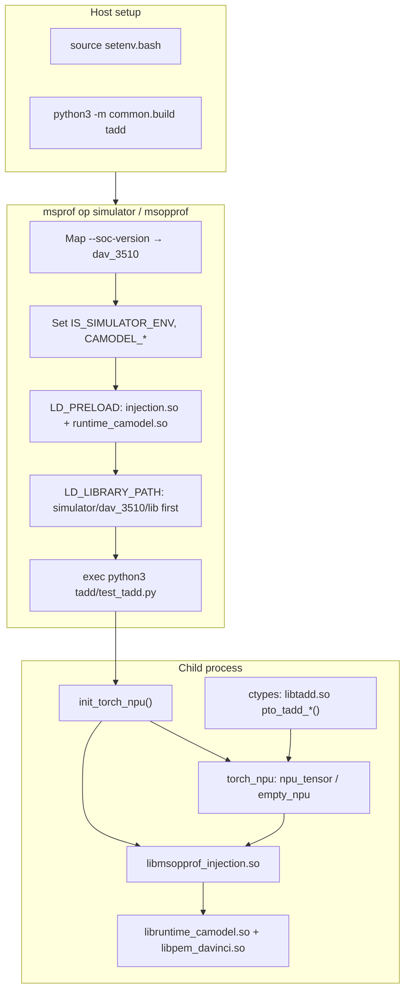

# msprof Runtime Injection Mechanism (torch_sim)

How `msprof op simulator` runs torch_npu + ctypes kernels on the CPU CA model **without** compile-time `-lruntime_camodel`.

## Overview

| Path | How camodel is attached |
|------|-------------------------|
| `tests/cpp` | Link `-lruntime_camodel` into the test binary at build time |
| `tests/torch_sim` | msopprof injects camodel into the **process** at run time via `LD_PRELOAD` |

Both paths load the same `libruntime_camodel.so` backend. torch_sim only omits the link flag from `lib<op>.so`; msopprof supplies camodel when the Python process starts.

```
msprof op simulator
    → msopprof (SimulatorTask: "Binary Simulation Running")
        → sets LD_PRELOAD, LD_LIBRARY_PATH, CAMODEL_*, IS_SIMULATOR_ENV
        → exec python3 test_<op>.py
            → torch_npu (ACL) ──► libmsopprof_injection.so ──► libruntime_camodel.so
            → ctypes ──► lib<op>.so (kernel launch via stream pointer)
```

## Crucial library paths

Assume `ASCEND_HOME_PATH=/usr/local/Ascend/cann-9.0.0` (adjust for your install).

| Role | Path |
|------|------|
| msprof CLI | `$ASCEND_HOME_PATH/bin/msprof` |
| msopprof runner (invoked by msprof) | `$ASCEND_HOME_PATH/tools/msopprof/bin/msopprof` |
| ACL injection / profiling hooks | `$ASCEND_HOME_PATH/tools/msopprof/lib64/libmsopprof_injection.so` |
| CA model runtime (preloaded) | `$ASCEND_HOME_PATH/aarch64-linux/simulator/dav_3510/lib/libruntime_camodel.so` |
| PEM simulator | `$ASCEND_HOME_PATH/aarch64-linux/simulator/dav_3510/lib/libpem_davinci.so` |
| NPU driver camodel stub | `$ASCEND_HOME_PATH/aarch64-linux/simulator/dav_3510/lib/libnpu_drv_camodel.so` |
| Simulator lib dir (LD_LIBRARY_PATH prefix) | `$ASCEND_HOME_PATH/tools/simulator/dav_3510/lib` |
| SoC alias → dav_3510 | `$ASCEND_HOME_PATH/tools/simulator/Ascend950PR_9599` → `dav_3510` |
| Real ACL runtime (loaded by torch_npu) | `$ASCEND_HOME_PATH/aarch64-linux/lib64/libascendcl.so` |
| ACL RT implementation | `$ASCEND_HOME_PATH/aarch64-linux/lib64/libacl_rt_impl.so` |
| torch_sim kernel artifact | `tests/torch_sim/<op>/build/lib<op>.so` |

Implementation note: the https://gitcode.com/Ascend/msprof repo is primarily **analysis/parsing**. Simulator injection lives in CANN’s **msopprof** package, not in the msprof analysis Python tree.

## Environment injected by msopprof

When `msprof op simulator` launches your application, msopprof rewrites the child process environment (observed values):

```bash
LD_PRELOAD=$ASCEND_HOME_PATH/tools/msopprof/lib64/libmsopprof_injection.so:libruntime_camodel.so
LD_LIBRARY_PATH=$ASCEND_HOME_PATH/tools/simulator/dav_3510/lib:...
IS_SIMULATOR_ENV=true
CAMODEL_SOC_VERSION=Ascend950PR_9599          # matches --soc-version
CAMODEL_LOG_PATH=<--output>/OPPROF_*/device0/tmp_dump
MSOP_SOCKET_PATH=/tmp/msop_connect.*.sock     # profiling IPC
```

What each piece does:

- **`libruntime_camodel.so` (LD_PRELOAD)** — same CA model library the cpp tests link against; runs AICore kernels on CPU (PEM model).
- **`libmsopprof_injection.so` (LD_PRELOAD)** — hooks ACL entry points (`aclrtMalloc`, `aclrtLaunchKernel`, …) for profiling and routes calls through the camodel backend.
- **`LD_LIBRARY_PATH` (simulator first)** — resolves simulator-side libs (`libpem_davinci.so`, `libnpu_drv_camodel.so`, …).
- **`IS_SIMULATOR_ENV` / `CAMODEL_SOC_VERSION`** — tell the runtime to use simulator mode for the selected SoC.
- **Symbol link runtime → simulator** — msopprof also symlinks runtime stub paths to simulator libs before exec (see msopprof log strings).

## Host environment setup (manual)

Before building or running torch_sim tests:

```bash
export ASCEND_HOME_PATH=/usr/local/Ascend/cann-9.0.0   # or your CANN root
source ${ASCEND_HOME_PATH}/bin/setenv.bash

# Optional but recommended by run_smoke.sh for Ascend950:
SIM_LIB="${ASCEND_HOME_PATH}/tools/simulator/Ascend950PR_9599/lib"
export LD_LIBRARY_PATH="${SIM_LIB}:${LD_LIBRARY_PATH:-}"
ulimit -n 65535
```

Python deps (once):

```bash
cd tests/torch_sim
pip install -r requirements.txt
```

Build kernels (no `-lruntime_camodel`):

```bash
cd tests/torch_sim
python3 -m common.build tadd          # one operator
python3 -m common.build --all       # all operators
```

## Calling procedures

### Single operator under msprof simulator

```bash
source ${ASCEND_HOME_PATH}/bin/setenv.bash
cd tests/torch_sim

python3 -m common.build tadd

msprof op simulator \
  --soc-version=Ascend950PR_9599 \
  --output=msprof_res/tadd \
  python3 tadd/test_tadd.py
```

Expected: `test_tadd.py::case_float_64x64 PASSED`, `case_int32_64x64 PASSED`.

### All smoke tests

```bash
source ${ASCEND_HOME_PATH}/bin/setenv.bash
cd tests/torch_sim
chmod +x run_smoke.sh
./run_smoke.sh
```

### Real NPU (no msprof injection)

```bash
source ${ASCEND_HOME_PATH}/bin/setenv.bash
cd tests/torch_sim
./run_direct.sh
```

Requires physical Ascend950 (or an environment where torch_npu sees a device). Same test scripts; no `LD_PRELOAD` camodel injection.

### Optional: filter kernel for profiling

```bash
msprof op simulator \
  --soc-version=Ascend950PR_9599 \
  --kernel-name='_Z7runTAddIfLi64ELi64ELi64ELi64ELi64ELi64ELi64ELi64EEvPT_S1_S1_' \
  --output=msprof_res/tadd \
  python3 tadd/test_tadd.py
```

Resolve mangled names with `nm -D <op>/build/lib<op>_kernel.so`.

## End-to-end call flow



1. **Build** — bisheng compiles kernel + `launch_api.cpp` into `lib<op>.so`; link uses `-lstdc++` only (no camodel).
2. **Wrap** — `msprof op simulator` starts msopprof’s `SimulatorTask` ("Binary Simulation Running").
3. **Inject** — msopprof sets `LD_PRELOAD`, simulator `LD_LIBRARY_PATH`, and camodel env vars, then execs Python.
4. **torch_npu** — imports register the NPU backend; device alloc/stream APIs go through ACL.
5. **Injection layer** — `libmsopprof_injection.so` intercepts ACL calls and delegates to preloaded camodel.
6. **Kernel launch** — test calls `lib<op>.so` via ctypes with device pointers + stream from torch_npu; camodel executes the AICore kernel on CPU.
7. **Verify** — Python compares NPU output tensors against NumPy golden; msprof writes profiling data under `--output/OPPROF_*`.

## SoC version mapping (Ascend950)

`--soc-version=Ascend950PR_9599` resolves via symlink:

```text
$ASCEND_HOME_PATH/tools/simulator/Ascend950PR_9599 → dav_3510
$ASCEND_HOME_PATH/tools/simulator/dav_3510 → $ASCEND_HOME_PATH/aarch64-linux/simulator/dav_3510
```

Use `ls $ASCEND_HOME_PATH/tools/simulator/` to list available SoC aliases for other chips.

## torch_sim vs cpp: why no camodel link is needed

| Concern | cpp | torch_sim + msprof |
|---------|-----|-------------------|
| Device memory / streams | `main.cpp` calls ACL; binary links camodel | torch_npu calls ACL; camodel preloaded by msopprof |
| Kernel launch | Host binary links camodel | `lib<op>.so` receives stream + pointers from torch_npu |
| Who loads camodel | Dynamic linker via `-lruntime_camodel` | msopprof via `LD_PRELOAD` into Python process |

The kernel `.so` never calls ACL directly — it only uses bisheng launch templates with pointers passed from Python. All ACL/device semantics come from torch_npu inside the msopprof-wrapped process.

## Troubleshooting

| Symptom | Check |
|---------|-------|
| `Cannot find msopprof` | `source ${ASCEND_HOME_PATH}/bin/setenv.bash` |
| `Can't find valid libruntime_camodel.so` | Simulator lib on `LD_LIBRARY_PATH`; `--soc-version` valid |
| `Parse dynamic kernel config fail` under msprof | Avoid `torch.zeros(..., device="npu")`; use `empty_npu()` / `zeros_npu()` in `common/torch_runtime.py` |
| Works under msprof, fails on real NPU | Expected if no device; use `./run_direct.sh` only with hardware |
| Profiling output location | `--output` dir → `OPPROF_<timestamp>_*` |

## See also

- [torch_sim_design_doc.md](torch_sim_design_doc.md) — design rationale
- [README.md](README.md) — build and run commands
- [../cpp/README.md](../cpp/README.md) — compile-time camodel reference path
- [../python_wrapper/wrapper_design_doc.md](../python_wrapper/wrapper_design_doc.md) — why bare `LD_PRELOAD` alone is insufficient without msopprof
