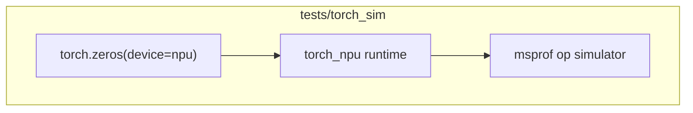

# torch_sim Design: torch_npu + msprof Without Real NPU

## Problem

Three ways to run the same PTO A5 smoke suite exist in this repo:

| Path | Device API | Simulator |
|------|------------|-----------|
| `tests/cpp` | ACL C++ | `-lruntime_camodel` at link time |
| `tests/python_wrapper` | pybind ACL + NumPy | `-lruntime_camodel` in `pto_runtime.so` |
| `tests/torch_sim` | torch_npu + ctypes | `msprof op simulator` at run time |

The reference `pto-kernels-a5sim/examples/jit_cpp/a5_abs` uses `torch.zeros(device="npu")` and `msprof op simulator` to exercise kernels without physical hardware. That is the pattern we mirror here.

## Why msprof fixes torch_npu-without-device

Importing `torch_npu` registers the NPU backend. Plain `tensor.to("npu")` on a machine with no Ascend950 card fails at runtime because the real driver has no device.

`msprof op simulator --soc-version=Ascend950PR_9599` wraps the Python process and provides a **CA model** for kernel execution. torch_npu allocation and launch calls go through the same API surface as real hardware, but the simulator backend satisfies them. No `-lruntime_camodel` link is required in `lib<op>.so`.

## Compile/link vs python_wrapper

| Aspect | python_wrapper | torch_sim |
|--------|----------------|-----------|
| Kernel compile | `-xcce --cce-aicore-arch=dav-c310-vec\|dav-c310` | same |
| Defines | `-DREGISTER_BASE` | same |
| Host `launch_api.cpp` | `-xc++ -std=c++17` | `-std=gnu++17` |
| Final link | `-lruntime_camodel` | **omit camodel**; `-lstdc++` only |
| pybind `pto_runtime` | built | **not built** |
| Run wrapper | direct Python | `msprof op simulator` |

Kernel sources and launch symbols are copied from `tests/python_wrapper` (same as cpp upstream). Test logic (golden generation, numeric thresholds) is shared via copied `numeric.py` and `acc_golden_smoke.py`.

## Accuracy validation

Smoke tests **assert numeric results** like cpp and python_wrapper (`0.001` float, `0.0` int/syncall/tload). The a5_abs example README notes msprof CA model may not guarantee fidelity for profiling-only runs; we still compare outputs. If a case fails only under msprof but passes under `run_direct.sh`, document the behavior here and adjust sync/format flags before declaring done.

### msprof-specific: avoid `torch.zeros` on device

Under msprof, `torch.zeros(..., device="npu")` dispatches the `ZerosLike` ACL op, which can fail with `Parse dynamic kernel config fail`. `common/torch_runtime.py` implements `zeros_npu()` by allocating on CPU via NumPy and copying with `torch.from_numpy(...).npu()` — the same pattern as a5_abs input staging. Use `empty_npu()` when the kernel fully overwrites the buffer.

## Portability to real NPU

Because kernels are bisheng-built with A5 flags and launched through torch_npu streams — not camodel-linked stubs — the same scripts run on real Ascend950 hardware via `./run_direct.sh` once `torch_npu` sees a device. This is the intended third path for teams already on the PyTorch Ascend stack.

## Related docs

- [Root README](../../README.md) — three-path overview
- [tests/cpp/README.md](../cpp/README.md) — C++ reference smoke harness
- [tests/python_wrapper/wrapper_design_doc.md](../python_wrapper/wrapper_design_doc.md) — NumPy + pybind + camodel (no torch)

The python_wrapper design doc explains why torch_npu alone was rejected for the lightweight path; torch_sim is the complementary approach that **does** use torch_npu, enabled by msprof.
