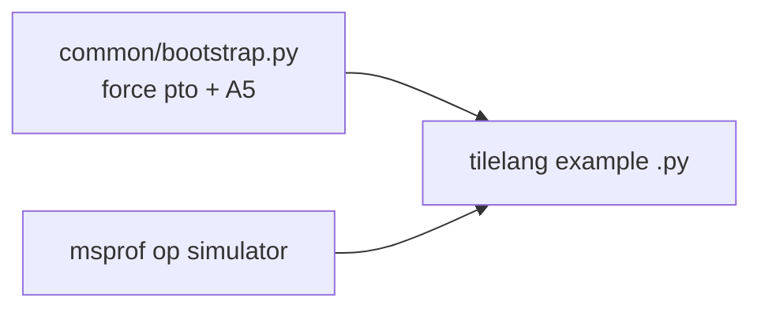

# TileLang-Ascend A5 CPU Simulation Tests

Runs [tilelang-ascend/examples](/workdir/tilelang-ascend/examples) under **msprof op simulator** (`Ascend950PR_9599`) with forced **`target="pto"`** and **`platform="A5"`**.

## Environment

- **TileLang-Ascend**: pre-installed at `/sources/tilelang-ascend` (Dockerfile L60–68); `TL_ROOT` / `PYTHONPATH` active via `~/.bashrc` — no rebuild or `set_env.sh` needed.
- **CANN 9.0**: source `${ASCEND_HOME_PATH}/bin/setenv.bash` and prepend simulator libs (handled by `run_single.sh`).
- **Examples path**: `/workdir/tilelang-ascend/examples`

## Quick start

```bash
cd /workdir/ptoisa-a5-test/tilelang_sim
chmod +x run_single.sh run_all.sh

# Regenerate manifest (127 entries, 115 runnable)
python3 -m common.collect_examples

# Pilot (5 representative examples)
./run_all.sh --pilot

# Full sequential sweep (~1–2 hours)
./run_all.sh
# Monitor: tail -f results/full_sweep.log
```

## Single example

```bash
./run_single.sh --rel-path elementwise/elementwise_add.py
./run_single.sh --id ex_0040 --timeout 30
```

## How it works



| Component | Role |
|-----------|------|
| [`common/bootstrap.py`](common/bootstrap.py) | Wraps `@tilelang.jit` → `target="pto"`, `platform="A5"`; skips `target="ascendc"` |
| [`common/reference_cpu_fallback.py`](common/reference_cpu_fallback.py) | CPU-first tensor alloc + reference ops for msprof compatibility |
| [`configs/small_shapes.json`](configs/small_shapes.json) | Reduced CLI sizes (e.g. `--m 128 --n 256`) |
| [`manifest.json`](manifest.json) | Inventory with skip reasons, timeouts, wrapper paths |

## Pass / fail criteria

| Status | Meaning |
|--------|---------|
| **PASS** | No crash + success marker (`Kernel Output Match!`, `Test Passed!`, etc.) |
| **FAIL_CRASH** | Python/runtime exception |
| **FAIL_COMPILE** | bisheng / TileLang compilation error |
| **FAIL_ACCURACY** | `assert_close` / assertion failure |
| **SKIP** | Out of scope (see below) |

## Explicit SKIP list (12 entries)

| Reason | Examples |
|--------|----------|
| `target=ascendc` | `gemm/example_gemm_intrinsic*.py`, `reduce/example_reduce_min_pipeline.py` |
| AOT / integration | `gemm_aot/run_example_gemm_aot.sh`, `torch_tl_ascend/test_example.sh` |
| Benchmark | 4× `bench_sfa` tasks, `fa_opt/run.py`, `fa_opt/plot.py` |
| Autotune | `autotune/example_gemm_*.py` |
| Non-TileLang | `fa_opt/flash_attn_bhsd_ascendc.py` |

## Outputs

| Path | Description |
|------|-------------|
| `results/logs/<id>.log` | Per-example stdout + status |
| `results/summary.json` | Machine-readable aggregate |
| `results/summary.md` | Human-readable PASS/FAIL/SKIP table |
| `results/full_sweep.log` | Full sweep console log |
| `results/progress.jsonl` | Incremental progress during sweep |
| [`pass_timings.json`](pass_timings.json) | Simulator timing for PASS examples (shapes + msprof metrics) |
| [`pass_timings.md`](pass_timings.md) | Human-readable PASS timing table |
| [`configs/pass_shapes.json`](configs/pass_shapes.json) | Input shapes used for PASS timing runs |

## PASS example simulator timings

```bash
./run_pass_timings.sh
```

See [`pass_timings.md`](pass_timings.md) for results.

## Regenerate summary only

```bash
python3 -m common.summarize_results
```

## References

- [ptoisa-a5-test/tests/torch_sim/run_smoke.sh](/workdir/ptoisa-a5-test/tests/torch_sim/run_smoke.sh)
- [pto-kernels/examples/a5_sim/README.md](/workdir/pto-kernels/examples/a5_sim/README.md) (timing: ~7–12 s/smoke on EPYC 9654)
- [tilelang/jit/adapter/libgen.py](/workdir/tilelang-ascend/tilelang/jit/adapter/libgen.py) L95–97 (A5 → `dav-c310`, `-DREGISTER_BASE`)

## Known limitations

- Many examples use the default **ascendc/auto** path on real NPU; forcing **PTO** may cause compile or accuracy failures — reported honestly.
- Complex reference paths (e.g. `torch.einsum` on NPU in flash attention) may fail under sim even when the TileLang kernel compiles.
- CPU sim is much slower than real hardware; small shapes in `configs/small_shapes.json` keep total runtime under ~1–2 h.
